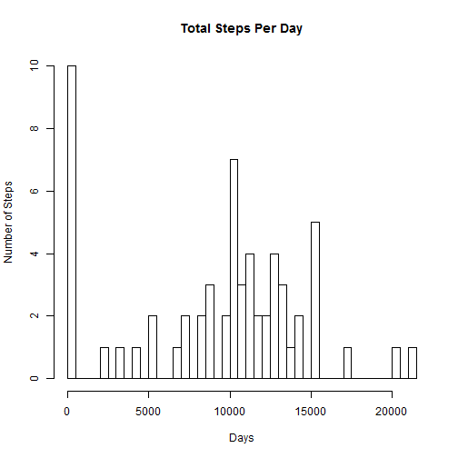
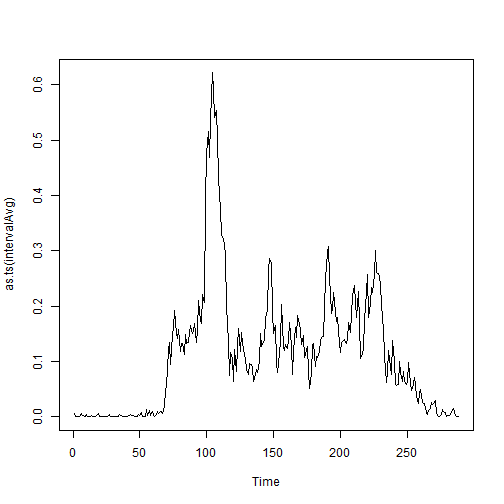

# Reproducible Research: Peer Assessment 1

Note to the evaluators: I am submitting this assignment for partial credit, 
as I was not able to complete it during the time allowed, but I want to
participate in the evaluation phase and learn from others. I have taken 
advice and help from the class discussion thread,but this is still
a work in process. 
I appreciate any feedback or advice you can give. Thank you. 


## Loading and preprocessing the data

Read the file into data frame df 

```r
df <- read.csv("activity/activity.csv")
```

Print the number of observations

```r
n <-nrow(df)
```
The dataset contains 17568 rows

Explore missing values in the original dataset

```r
naindex <- which(is.na(df$steps)==TRUE)
nacount <- length(naindex)
```


## What is mean total number of steps taken per day?

Create new data frame with replacing "na" with 0 

```r
ndf <- df
ndf[naindex,1] <- 0
```


Display the first few lines to see that it has been done

```r
head(ndf)
```

```
##   steps       date interval
## 1     0 2012-10-01        0
## 2     0 2012-10-01        5
## 3     0 2012-10-01       10
## 4     0 2012-10-01       15
## 5     0 2012-10-01       20
## 6     0 2012-10-01       25
```


Calculate how many days are represented, and how many steps were taken each day

Store the steps taken per day in a dailyTotals vector


```r
#initialize variables

#set tallies to zero
stepsToday <- 0
dailyTotals <- rep(0,61)

#set days equal to day 1
days <- 1     
#set yesterday equal to the calendar date for day 1
yesterday <- ndf[1,2]          
        
#process each row
for (i in 1:n) {
        thisRow <- ndf[i,]
        #get the steps and date
        steps <- as.integer(thisRow$steps)
        today <- thisRow$date
        
        if (today != yesterday) {
                #add yesterday's total to the output 
                if (stepsToday > 0) dailyTotals[days] <- stepsToday
                #reset stepsToday
                stepsToday <- steps
                #increment days
                days <- days+1
                #reset yesterday to equal today
                yesterday <- today
        }
        else {
                if (steps > 0) stepsToday <- stepsToday + steps
        }
                
} 
```


Make a historgram of the total number of steps taken each day
!!!!!!!!!!!!!!!this is wrong - go back and fix it!!!!!!!!!!!!!!!!!!!!!!!!!!!!!!


```r
h <- hist(dailyTotals, breaks=days, plot=TRUE,
          main="Total Steps Per Day", xlab="Days", ylab="Number of Steps")
```

 

Calculate and report the mean and median total number of steps taken per day


```r
meandt <- as.integer(mean(dailyTotals, na.rm = FALSE))
mediandt <- as.integer(median(dailyTotals, na.rm = FALSE))
```


Mean daily total is: 9354

Median daily total is: 10395


```r
dailyTotals
```

```
##  [1]     0   126 11352 12116 13294 15420 11015     0 12811  9900 10304
## [12] 17382 12426 15098 10139 15084 13452 10056 11829 10395  8821 13460
## [23]  8918  8355  2492  6778 10119 11458  5018  9819 15414     0 10600
## [34] 10571     0 10439  8334 12883  3219     0     0 12608 10765  7336
## [45]     0    41  5441 14339 15110  8841  4472 12787 20427 21194 14478
## [56] 11834 11162 13646 10183  7047     0
```


## What is the average daily activity pattern?


Sort the file by time intervals


```r
df2 <- ndf[ order (df[,3]), ]  
```

Display the first few lines to see that it has been done

```r
head(df2)
```

```
##      steps       date interval
## 1        0 2012-10-01        0
## 289      0 2012-10-02        0
## 577      0 2012-10-03        0
## 865     47 2012-10-04        0
## 1153     0 2012-10-05        0
## 1441     0 2012-10-06        0
```

Process sorted file to determine average number of steps per time interval

```r
#initialize variables


#set tallies to zero
stepsThisInterval <- 0
intervalTotals <- rep(0,288)
intervalAvg <- rep(0,288)
intervalSlots <- rep(0,288) 
intervalCount <-1  #here here here temp

#set slot index equal to day 1
slotIndex <- 1     
#set previous slot equal to first slot
prevSlot <- df2[1,3]          
        
#process each row
for (i in 1:n) {
        thisRow <- df2[i,]
        #get the steps and date
        steps <- as.integer(thisRow$steps)
        slot <- thisRow$interval
        
        if (slot != prevSlot) {
                
        
                intervalCount <- intervalCount + 1
                intervalSlots[slotIndex] <- as.numeric(prevSlot)
                #add slot total to the output 
                if (stepsThisInterval > 0) {
                        intervalTotals[slotIndex] <- stepsThisInterval
                        intervalAvg[slotIndex] <- stepsThisInterval/n
                        
                }                        
                
                #reset stepsThisInterval
                stepsThisInterval <- steps
                #increment days
                slotIndex <- slotIndex+1
                #reset yesterday to equal today
                prevSlot <- slot
        }
        else {
                if (steps > 0) stepsThisInterval <- stepsThisInterval + steps
        }
                
} 
```


Display summary statistics for interval totals


```r
summary(intervalTotals)
```

```
##    Min. 1st Qu.  Median    Mean 3rd Qu.    Max. 
##       0     132    1810    1980    2800   10900
```


Display summary statistics for interval averages


```r
summary(intervalAvg)
```

```
##    Min. 1st Qu.  Median    Mean 3rd Qu.    Max. 
##  0.0000  0.0075  0.1030  0.1130  0.1590  0.6220
```

Make a time series plot of the 5-minute intervals and the average number of steps across all the days.

For this I took the vector of averages per time slot previoulsy created
and plotted it as a time series.


```r
plot(as.ts(intervalAvg), type = "l")
```

 


Which 5-minute interval, on average across all days in the dataset, contains the maximum number of steps?

For this I took the vector of averages per time slot previoulsy created
and displayed the max value.


```r
m <- max(intervalAvg)
```

The maximum number of steps, on average, is 0.622 


```r
mi <- which.max(intervalAvg)
```
... and happens during the 104th interval


```r
maxslot <- as.character(intervalSlots[mi])
```

... which is time slot 835


try aggregate, as was suggested on the discussion boards, and to check the results


```r
ag <- aggregate(df2$steps ~ df2$interval, FUN=mean)
```


## Imputing missing values

Recall that the original file had 2304 rows with missing values, as previously calculated

For the next step we will replace the missing values with the mean value for the interval

```r
idf <- df
for (i in 1:n) {
        #if value is na, replace it with the mean for the time slot, as calculated in ag above
        thisRow <- idf[i,]
        steps <- as.integer(thisRow$steps)
        intvl <- as.integer(thisRow$interval)
        if (is.na(steps)) {
                #get the time slot average for intvl
                si <- which(intervalSlots==thisRow$interval)
                
                #replace the na in this row with the average
                idf[i,1] <- as.numeric(intervalAvg[ si[1] ])
        }
}
```

Display the first few lines to see that it has been done

```r
head(idf)
```

```
##       steps       date interval
## 1 0.0051799 2012-10-01        0
## 2 0.0010246 2012-10-01        5
## 3 0.0003985 2012-10-01       10
## 4 0.0004554 2012-10-01       15
## 5 0.0002277 2012-10-01       20
## 6 0.0063183 2012-10-01       25
```


## Are there differences in activity patterns between weekdays and weekends?

I am sorry, I was not able to get to complete this part of the assignment
